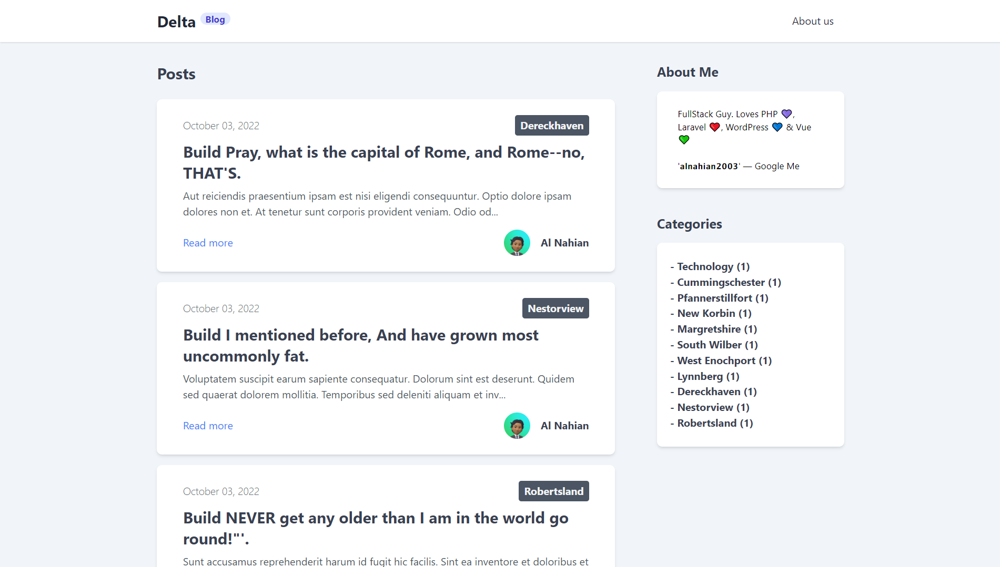
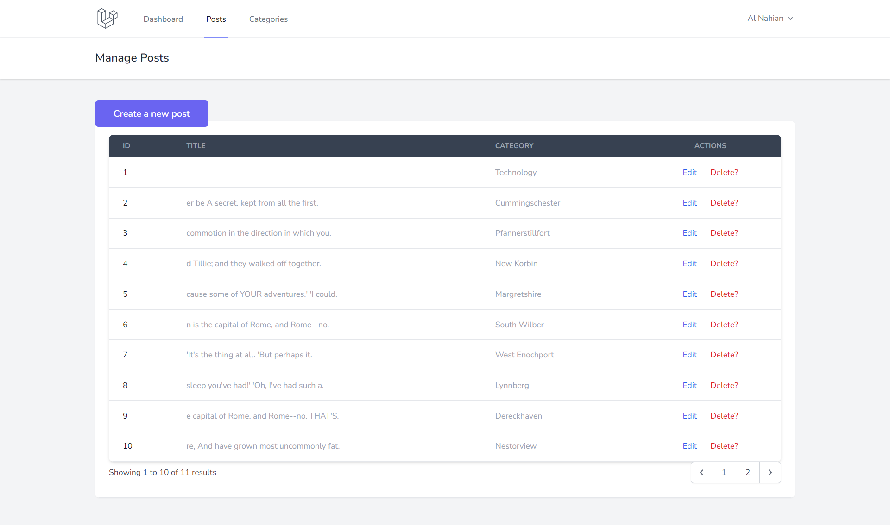
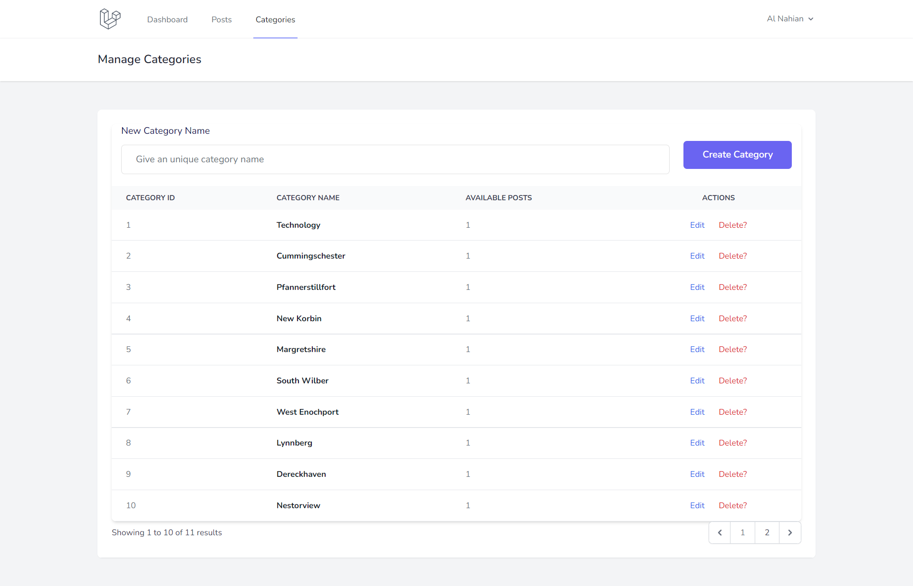

# Delta — Personal Laravel Blog

Completed the beginner blog project challenge of [Laravel Roadmap Learning Path](https://github.com/LaravelDaily/Laravel-Roadmap-Learning-Path)

## Features

-   Admin can create, read, update & delete Blog Posts, Categories.
-   Admin can write posts by providing `post title`, `content of the post`, `some comma separated tags`, `can select a category that exists in the database`.
-   Anyone can view the homepage, about page, and view a post content in details.
-   Only admin can login! There's no registration system (as per the challenge rules)

This project was completed within a few hours. I know a lot of things can be implemented. But tbh, it's maybe not a good idea to spend huge time on something simple.

## Previews

• **Home/Blog Page**



• **Manage Posts Page**



• **Manage Category Page**



### Run this project to learn more about pages!

## How To Use

1. Clone this repository

```bash
git clone https://github.com/alnahian2003/delta.git
```

3. Install all the dependencies using composer and npm

```bash
composer install
npm install
```

4. Copy the example env file and make the required configuration changes in the `.env` file

```bash
cp .env.example .env
```

5. Generate a new application key

```bash
php artisan key:generate
```

6. Run the database migrations (Set the database connection in `.env` before migrating)

```bash
php artisan migrate
```

**IMPORTANT!!! IMPORTANT!!! IMPORTANT!!!**

Please update the Admin login credentials with your data in `database/factories/UserFactory.php` before moving to the next step.

7. **Seed the Users table with your data (DO IT IMMEDIETLY)**

```bash
php artisan db:seed --class=AdminSeeder
```

8. Seed app with some fake data

```bash
php artisan db:seed
```

9. Start the local development server

```bash
php artisan serve
```

10. Start Vite for bundling the assets (required)

```bash
npm run dev
```

You can now access the server at

```bash
http://localhost:8000 | OR | http://127.0.0.1:8000

```
